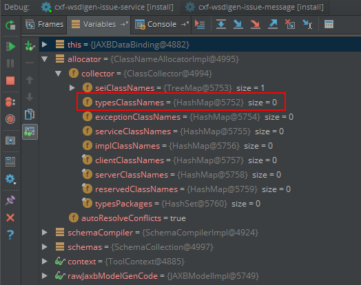
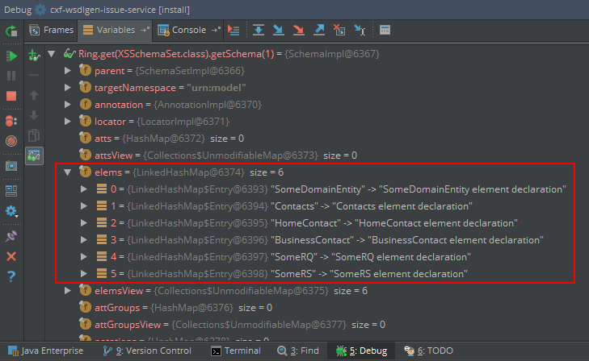
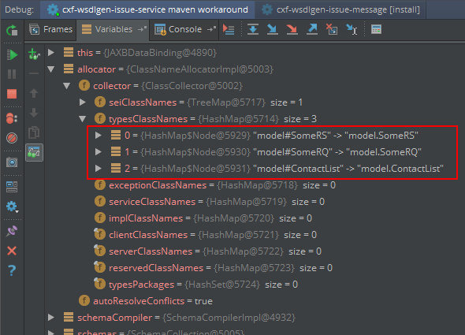

# CXF Compilation Episode Issue 

This example demonstrates a problem in CXF referencing types in the WSDL that are part of previous compilation episodes.

### Versions

The test uses JDK 1.8u121 (JAXB 2.2.11) and CXF 3.1.10

The 2 classes of interst are:

- org.apache.cxf.tools.wsdlto.databinding.jaxb.JAXBDataBinding
- com.sun.tools.xjc.reader.xmlschema.BGMBuilder

### Problem

CXF fails when using existing compilation expisodes of schemata in same or other namespace.

### Expected

Generation of a SEI that references `{model}SomeRQ` type as the request and `{model}SomeRS` as response type. 

### Actual

```
[ERROR] Failed to execute goal org.apache.cxf:cxf-codegen-plugin:3.1.10:wsdl2java (generate-wsdl-bindings) on project cxf-wsdlgen-issue-service:
  Execution generate-wsdl-bindings of goal org.apache.cxf:cxf-codegen-plugin:3.1.10:wsdl2java failed:
    Failed to create java parameter for part [body] in method [invoke] - this wsdl is invalid, please use the wsdlvalidator tool to validate this wsdl -> [Help 1]
```

### Description

Including a schema from an earlier compilation episode in a wsdl schema with the same namespace will cause to CXF fail when resolving the Java type when constructing the wsdl operation parameter.

```
parent
  |
  +-- model (with episode)
  |     |
  |     +-- model schema in urn:model
  |     |
  |     +-- xjc generated episode
  |
  +-- service
        |
        +-- message schema in urn:model
        |    |
        |    +-- include model schema
        |    |
        |    +-- the wsdl operation message element is defined in this schema file
        |
        +-- wsdl in urn:service
             |
             +-- import message schema
             |
             +-- wsdl messages reference request and response payload from message schema
             |
             +-- wsdl operation references above wsdl messages
```

The test case is setup in a way that one can see the wsdl generation failing in its original form:

```sh
mvn clean install
```

and with a workaround where the episode from the previous compilation is pre-processed and the map attribute is set to `true`:

```sh
mvn clean install -Dworkaround=true
```

CXF does not see the types of the previous episode. The ClassSelector it registers with the XJC schema builder is not populated with the type information of the current schema set and neither with any types that have been included into the XJC compilation with reference to previous compilation episodes.

In `com.sun.tools.xjc.reader.xmlschema.BGMBuilder:L299` any schema that has it's binding attribute map set to false will be excluded from being pushed into any provided ClassSelector:

```java
for( XSSchema s : Ring.get(XSSchemaSet.class).getSchemas() ) {
    BISchemaBinding sb = getBindInfo(s).get(BISchemaBinding.class);

    if(sb!=null && !sb.map) {
        sb.markAsAcknowledged();
        continue;       // no mapping for this package  <<<<<<<<<<<<<<<< schema is part of a previous episode
    }

    getClassSelector().pushClassScope( new CClassInfoParent.Package(
        getClassSelector().getPackage(s.getTargetNamespace())) );

    checkMultipleSchemaBindings(s);
    processPackageJavadoc(s);
    populate(s.getAttGroupDecls(),s);
    populate(s.getAttributeDecls(),s);
    populate(s.getElementDecls(),s);                    <<<<<<<<<<<<<<<< XJC would have to reach here to populate the supplied CXF ClassSelector
    populate(s.getModelGroupDecls(),s);
    ...
}
```

I argue this is not a XJC bug but a flaw in the approach of the CXF JAXBDataBinding module to get type information from XJC. It uses XJC to process the schemata but then it only registers a handler with XJC to receive the type information that is part of the current compilation episode but not any previous ones. This will cause any references to types defined in previous compilation episodes to be not available to CXF when building the WSDL model. 

### Case 1: Original Episode provided to wsdl2java

```sh
mvn clean install
```

Using following episode file:

```xml
<?xml version="1.0" encoding="utf-8"?>
<bindings version="2.1" xmlns="http://java.sun.com/xml/ns/jaxb" if-exists="true">

  <bindings xmlns:tns="urn:model" scd="x-schema::tns">
    <!-- package model is flagged as already excluded -->
    <schemaBindings map="false">
      <package name="model"/>
    </schemaBindings>
    ...
  </bindings>

</bindings>
```

BGMBuilder:L306 Schema populated correctly with an original episode file:


ClassCollector on JAXBDataBinding:L462 does not contain any of the types of previous episodes:




### Case2: Edited Episode provided to wsdl2java

```sh
mvn clean install -Dworkaround=true
```

Using following episode file:

```xml
<?xml version="1.0" encoding="utf-8"?>
<bindings version="2.1" xmlns="http://java.sun.com/xml/ns/jaxb" if-exists="true">

  <bindings xmlns:tns="urn:model" scd="x-schema::tns">
    <!-- package model is flagged as included but types of previous episode are listed as already present -->
    <schemaBindings map="false">
      <package name="model"/>
    </schemaBindings>
    
    <bindings if-exists="true" scd="~tns:SomeDomainEntity">
      <class ref="model.SomeDomainEntity"/>
    </bindings>
    ...
  </bindings>

</bindings>
```

BGMBuilder Schema populated correctly with an altered episode file:



ClassCollector on JAXBDataBinding:L462 now contains a type reference to any types in the current xjc compilation episode (which in this test case is the wsdl message types) but still missing any types of previous episodes:



The cxf ClassSelector provided to BGMBuilder is not populated with all known classes but only those that have been in schemata that are not part of a prior compilation episodes.


ClassSelector provided to BGMBuilder on line JAXBDataBinding:L365 (wrapped in allocator) would normally need to be populated by the BGMBuilder:L311 > BGMBuilder:L352.

This problem is also the root cause for [CXF-7074](https://issues.apache.org/jira/browse/CXF-7074) as in this case the `u:Fault` type is imported from a prior compilation episode.
